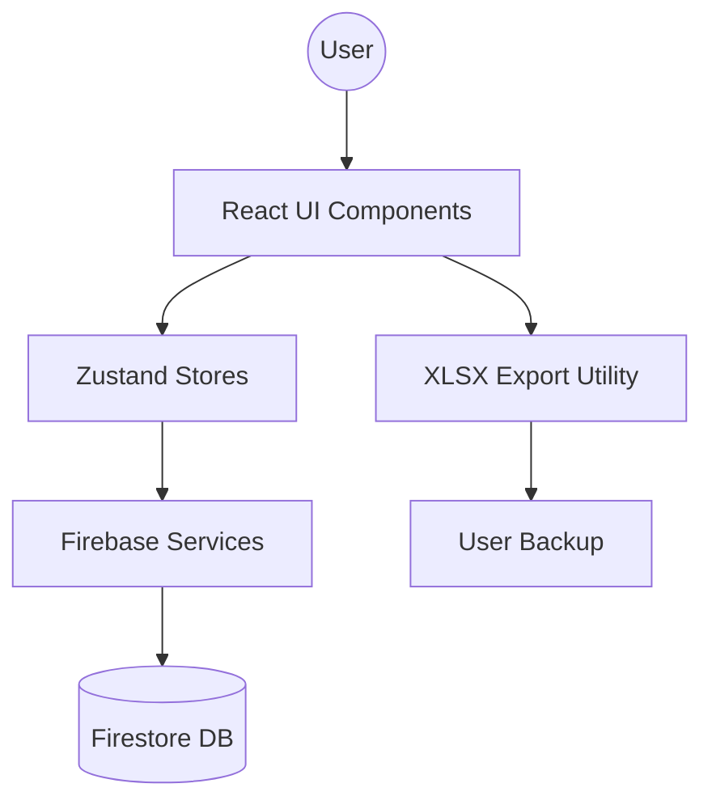

# Architecture & System Design

MietProzess follows a modern, decoupled architecture designed for speed and reliability.

## 📐 Overview
The system is built on a "Store-First" principle where the UI reacts to state changes in Zustand, which in turn synchronizes with Firebase Firestore.

## 🧠 State Management
- **Apartment Store**: Manages the list of apartments, filters, and current status.
- **Auth Store**: Manages login state and user metadata.
- **Notification Store**: Manages global toast notifications.

## 🗄️ Database Schema (Firestore)
- `apartments`: 
    - `id`: String (Auto-generated)
    - `address`: String
    - `status`: Enum (In Kündigung, In Vermietung, etc.)
    - `checklist`: Array of objects
    - `comments`: Array of objects
    - `lastActivity`: ISO Timestamp
- `authorized_users`:
    - `email`: String (Whitelist for login)

## ⚡ Performance
- **Vite**: Ultra-fast HMR and production builds.
- **Tailwind**: Atomic CSS for minimal bundle sizes.
- **Firestore**: Real-time listeners enable instant UI updates across devices.
