# HIT Flow - Business Process Documentation

This document explains the core logic, workflow rules, and automation implemented in the HIT Flow application for Heinzer Immobilien. It is designed to be easy to read and understand.

## 1. The Core Workflow (The 5 Stages)

The application manages property terminations through a strict 5-stage pipeline. Every termination case moves from left to right through these stages.

```mermaid
graph LR
    A[In Kündigung] --> B[In Vermietung]
    B --> C[Mietvertrag erstellt]
    C --> D[Wohnung übergeben]
    D --> E[Abgeschlossen]
    
    style A fill:#fee2e2,stroke:#ef4444,color:#000
    style B fill:#fef9c3,stroke:#eab308,color:#000
    style C fill:#dbeafe,stroke:#3b82f6,color:#000
    style D fill:#dcfce7,stroke:#22c55e,color:#000
    style E fill:#f3f4f6,stroke:#64748b,color:#000
```

### The Stages Explained:
1.  **In Kündigung (Termination Received)**: The process starts here when a tenant cancels. The focus is on confirming the date and preparing for marketing.
2.  **In Vermietung (Marketing)**: The property is actively being advertised. Viewings take place.
3.  **Mietvertrag erstellt (Contract)**: A new tenant is found, and the contract is being drawn up/signed.
4.  **Wohnung übergeben (Handover)**: The old tenant leaves, and the new tenant gets the keys.
5.  **Abgeschlossen (Completed)**: All tasks are done. The case is closed.

---

## 2. Business Rules & Automation

To ensure data quality, the system enforces several rules automatically.

### Rule #1: The "No-Skip" Policy (Validation)
You cannot move a card **forward** to the next stage until you have completed **100%** of the tasks in the current stage's checklist.
*   *Example:* You cannot move a flat from "In Kündigung" to "In Vermietung" if you haven't ticked off "Kündigungsbestätigung versenden".
*   *Exception:* You can always move a card **backward** if you made a mistake.

### Rule #2: The "New Tenant" Trigger
There is a specific task in the checklist called **"Mietvertrag unterzeichnet retour"**.
*   **Action:** When you tick this box.
*   **System Response:** A popup immediately appears, forcing you to enter the **New Tenant's Name** and **Rental Start Date**.
*   **Why?**: This ensures we never forget to record who the new tenant is once the contract is signed.

### Rule #3: Auto-Archiving
We keep the board clean.
*   **Trigger:** A case sits in the **"Abgeschlossen"** column.
*   **Timing:** 30 days after it was finished.
*   **Action:** It is automatically hidden from the main view.
*   **How to find it:** You can always see these old cases by clicking the **"Archiv anzeigen"** toggle button.

---

## 3. Activity & Tracking

The system watches everything to allow for full transparency.

*   **Activity Traffic Light**:
    *   🟢 **Green** (Internal Logic): Recently updated.
    *   🟡 **Yellow**: No updates for 7-14 days.
    *   🔴 **Red**: No updates for 15+ days. (Need to take action!)
    
*   **Checklist Audit**:
    *   Every time you tick a box, the system saves **Who** did it (Initials, e.g., "AM") and **When** (Date). This is visible right next to the task.

---

## 4. Summary Diagram

```mermaid
sequenceDiagram
    participant User
    participant System
    participant Database

    User->>System: Creates new Termination (In Kündigung)
    System->>Database: Saves Record (Starts Timer)
    
    loop Daily Work
        User->>System: Completes Checklist Tasks
        System->>Database: Updates Progress & Initials
        
        opt "Mietvertrag unterzeichnet retour" Checked
            System->>User: HOSTAGE POPUP: "Enter New Tenant!"
            User->>System: Enters New Tenant Data
            System->>Database: Saves Tenant Info
        end
    end

    User->>System: Tries to drag to next stage
    alt Checklist Incomplete
        System--xUser: BLOCK: "Please finish tasks first!"
    else Checklist Complete
        System->>Database: Updates Status
        System->>User: Success! Card moves forward.
    end
    
    Note over System, Database: 30 Days after 'Abgeschlossen'
    System->>User: Hides card (Archived)
```

