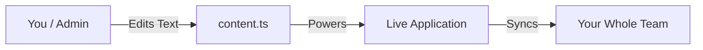

# No-Code Admin Master Guide

This guide is for the person managing the MietProzess tool. It explains how to be the "Architect" of your own tool without needing to be a programmer.

## 🧠 The Concept of "Config-First"
Instead of burying settings deep in code, we have pulled the **Brain** of the app out into simple text files.

## 🛠️ Mastery Level 1: UI Management
You can change the face of the app by editing `src/lib/content.ts`.

| What you want to do | Where to look in `content.ts` |
| :--- | :--- |
| **Change the App Name** | `header.title` |
| **Rewrite the Login Welcome** | `login.title` & `subtitle` |
| **Update the Help Guide** | `help.sections` |
| **Change Button Texts** | `header.export`, `header.help`, etc. |

## 🛠️ Mastery Level 2: User Control
Access is guarded by the **Whitelist**.
- **To Add a User**: Go to Firebase Console -> Firestore -> `authorized_users`. Add a new "Document" with a field `email`.
- **To Remove a User**: Simply delete their document from the list.

## 🛠️ Mastery Level 3: Notification Control
Open `src/lib/notifications.ts`.
- Set `enabled: false` to silence specific alerts.
- Change the `message` to your preferred wording.

## 📉 Future-Proofing
If you ever feel the tool is "too simple" and you want to add more complex fields (like a map integration or advanced reporting), the foundation is already built to be **Scalable**. You won't have to throw anything away; you just add to it.

---
**Need help?** All these files are formatted in "Human-Readable" structures. If you can edit a JSON file or a simplified text file, you can manage 90% of this application!
