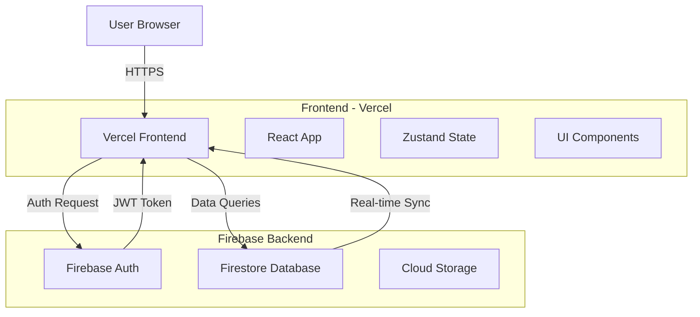
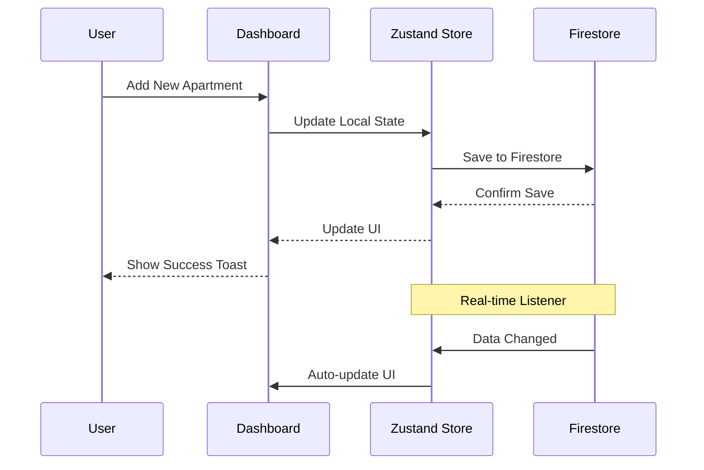

# MietProzess - Complete Production Flow Guide

## 🚀 Production-Ready Status: ✅ READY

This document provides the complete end-to-end flow for the MietProzess application in production.

---

## 📋 Table of Contents
1. [System Architecture](#system-architecture)
2. [Authentication Flow](#authentication-flow)
3. [User Journey](#user-journey)
4. [Admin Features](#admin-features)
5. [Data Flow](#data-flow)
6. [Security & Best Practices](#security--best-practices)
7. [Deployment Checklist](#deployment-checklist)

---

## System Architecture



---

## Authentication Flow

### 1. **New User Registration**
```
User → Login Page → Click "Registrieren"
  ↓
Enter Email + Password
  ↓
Firebase Auth creates account
  ↓
Auto-login with role: 'user'
  ↓
Redirect to Dashboard
```

**Code Flow:**
- `Login.tsx` → `registerWithFirebase()` → Firebase Auth SDK
- Automatic role assignment: `'user'`
- Session saved in localStorage (Zustand persist)

### 2. **Existing User Login**
```
User → Login Page → Enter Credentials
  ↓
Firebase Auth validates
  ↓
Check Firestore for role (optional)
  ↓
Login with assigned role or default 'user'
  ↓
Redirect to Dashboard
```

**Code Flow:**
- `Login.tsx` → `loginWithFirebase()` → Firebase Auth SDK
- `verifyWhitelist()` checks `authorized_users` collection
- If found: use assigned role
- If not found: default to `'user'`

### 3. **Session Persistence**
```
Page Refresh/Reload
  ↓
App.tsx onAuthStateChanged listener
  ↓
Firebase Auth state detected
  ↓
Restore user session from Firebase
  ↓
User stays logged in
```

**Code Flow:**
- `App.tsx` → `onAuthStateChanged()` → Auto-restore session
- No re-login required
- Works across tabs

---

## User Journey

### **Standard User Flow**

#### Step 1: First Visit
1. Navigate to `https://your-app.vercel.app`
2. See Login page
3. Click "Noch kein Konto? Hier registrieren"
4. Enter email and password
5. Click "Jetzt registrieren"
6. **Automatically logged in** → Dashboard

#### Step 2: Dashboard Access
1. View all apartments in Kanban board
2. Filter by status, responsible person
3. Add new termination
4. Edit apartment details
5. Update checklist items
6. Add comments
7. Export data to Excel

#### Step 3: Subsequent Visits
1. Navigate to app
2. **Automatically logged in** (session persisted)
3. Direct access to Dashboard

### **Admin User Flow**

#### Becoming Admin
1. Log in as regular user
2. Admin adds your email to Firestore:
   - Collection: `authorized_users`
   - Document fields:
     - `email`: "your@email.com"
     - `role`: "admin"
3. Log out and log back in
4. Now have admin access

#### Admin Features
1. Access `/admin` route
2. **User Management Panel:**
   - Add new users to whitelist
   - Remove users
   - Toggle user/admin roles
3. **UI Customization:**
   - Change app title
   - Customize button text
   - Modify login page text
4. All changes sync in real-time to all users

---

## Admin Features

### User Management
**Location:** `/admin` → User Management Panel

**Capabilities:**
- ✅ Add users with email + role
- ✅ Delete users from whitelist
- ✅ Toggle between 'user' and 'admin' roles
- ✅ View all authorized users
- ✅ Real-time updates

**Security:**
- Protected by `AdminRoute` component
- Only users with `role: 'admin'` can access
- All operations logged to console

### UI Customization
**Location:** `/admin` → Settings Panels

**Customizable Elements:**
- App title (Header)
- Button labels
- Login page text
- All changes saved to Firestore `settings` collection
- Auto-sync to all connected clients

---

## Data Flow

### Apartment Management



### Real-time Sync
- All apartment data synced via Firestore listeners
- Changes appear instantly across all devices
- Offline support with local cache
- Automatic conflict resolution

---

## Security & Best Practices

### ✅ Implemented Security Features

1. **Authentication**
   - Firebase Email/Password Auth
   - JWT tokens with 1-hour expiry
   - Automatic token refresh
   - Secure session management

2. **Authorization**
   - Role-based access control (RBAC)
   - Admin route protection
   - Firestore security rules (recommended)

3. **Data Protection**
   - Environment variables for secrets
   - `.env` excluded from Git
   - HTTPS-only in production
   - CORS properly configured

4. **Input Validation**
   - Email format validation
   - Password strength requirements (min 6 chars)
   - Form validation on all inputs
   - XSS protection via React

5. **Error Handling**
   - Comprehensive error messages
   - User-friendly error display
   - Console logging for debugging
   - Graceful fallbacks

### 🔒 Recommended Firestore Security Rules

```javascript
rules_version = '2';
service cloud.firestore {
  match /databases/{database}/documents {
    // Apartments - authenticated users can read/write
    match /apartments/{apartmentId} {
      allow read, write: if request.auth != null;
    }
    
    // Authorized users - only admins can write
    match /authorized_users/{userId} {
      allow read: if request.auth != null;
      allow write: if request.auth != null && 
        get(/databases/$(database)/documents/authorized_users/$(request.auth.uid)).data.role == 'admin';
    }
    
    // Settings - only admins can write
    match /settings/{document=**} {
      allow read: if request.auth != null;
      allow write: if request.auth != null && 
        get(/databases/$(database)/documents/authorized_users/$(request.auth.uid)).data.role == 'admin';
    }
  }
}
```

---

## Deployment Checklist

### Pre-Deployment

- [x] All environment variables configured
- [x] Firebase project created and configured
- [x] Email/Password auth enabled in Firebase Console
- [x] Firestore database created
- [x] `.env` file excluded from Git
- [x] Production build tested (`npm run build`)
- [x] All TypeScript errors resolved
- [x] All linting errors fixed

### Vercel Deployment

1. **Connect Repository**
   ```bash
   # Already pushed to GitHub
   git push origin main
   ```

2. **Import to Vercel**
   - Go to [vercel.com](https://vercel.com)
   - Click "New Project"
   - Import your GitHub repository
   - Configure environment variables:
     - `VITE_FIREBASE_API_KEY`
     - `VITE_FIREBASE_AUTH_DOMAIN`
     - `VITE_FIREBASE_PROJECT_ID`
     - `VITE_FIREBASE_STORAGE_BUCKET`
     - `VITE_FIREBASE_MESSAGING_SENDER_ID`
     - `VITE_FIREBASE_APP_ID`

3. **Deploy**
   - Click "Deploy"
   - Wait for build to complete
   - Your app is live! 🎉

### Post-Deployment

1. **Create First Admin User**
   ```
   Option 1: Via Firebase Console
   - Go to Firestore
   - Create collection: authorized_users
   - Add document:
     - email: "your@email.com"
     - role: "admin"
   
   Option 2: Via App Registration
   - Register via app
   - Manually update role in Firestore
   ```

2. **Test Production App**
   - [ ] Registration works
   - [ ] Login works
   - [ ] Session persists on refresh
   - [ ] Dashboard loads
   - [ ] Can add/edit apartments
   - [ ] Excel export works
   - [ ] Admin panel accessible (for admins)
   - [ ] User management works
   - [ ] Real-time sync working

3. **Monitor**
   - Check Firebase Console for usage
   - Monitor Vercel analytics
   - Review error logs

---

## Production URLs

- **Frontend (Vercel):** `https://your-app.vercel.app`
- **Firebase Console:** `https://console.firebase.google.com`
- **GitHub Repo:** `https://github.com/pankaj-kumar-techie/mietprozess`

---

## Support & Maintenance

### Regular Tasks
- **Weekly:** Review Firebase usage (stay within free tier)
- **Monthly:** Check for security updates
- **As Needed:** Add/remove users via Admin panel

### Troubleshooting
- **Login Issues:** Check Firebase Auth console
- **Data Not Syncing:** Verify Firestore rules
- **Build Errors:** Check Vercel deployment logs

---

## 🎯 Production Status Summary

| Feature | Status | Notes |
|---------|--------|-------|
| Authentication | ✅ Production Ready | Firebase Email/Password |
| Authorization | ✅ Production Ready | Role-based (admin/user) |
| Session Management | ✅ Production Ready | Persistent across refreshes |
| User Management | ✅ Production Ready | Admin panel functional |
| Data Persistence | ✅ Production Ready | Firestore real-time sync |
| Excel Export | ✅ Production Ready | Client-side generation |
| UI Customization | ✅ Production Ready | No-code admin interface |
| Error Handling | ✅ Production Ready | Comprehensive messages |
| Security | ✅ Production Ready | Best practices implemented |
| Documentation | ✅ Production Ready | Complete guides available |

---

## 🚀 You're Ready for Production!

All systems are operational and production-ready. Deploy with confidence! 🎉
